<div align="center">

# PrepEdge

### AI-Powered Subscription-Based Interview Preparation Platform

Prepare for placements and technical interviews with coding practice, aptitude training, communication development, AI-powered guidance, and personalized recommendations.

<br>


</div>

---

## About PrepEdge

PrepEdge is a smart interview preparation platform designed to help students and job seekers build confidence and improve their placement readiness through structured learning, AI assistance, and progress tracking.

The platform integrates technical learning, aptitude practice, communication training, expert guidance, and subscription-based premium content into a single ecosystem.

---

## Core Features

<table>
<tr>
<td width="50%">

### Learning Modules

* Programming Practice
* Aptitude Preparation
* Communication Skills
* Company Preparation
* Expert Talks

</td>
<td width="50%">

### AI Features

* AI Interview Coach
* Personalized Recommendations
* Performance Analysis
* Career Guidance

</td>
</tr>

<tr>
<td width="50%">

### User Features

* Registration & Login
* Profile Management
* Progress Tracking
* Subscription Access

</td>
<td width="50%">

### Admin Features

* User Management
* Content Management
* Analytics Dashboard
* Subscription Management

</td>
</tr>
</table>

---

## Technology Stack

| Layer           | Technologies                       |
| --------------- | ---------------------------------- |
| Frontend        | HTML5, CSS3, JavaScript, Bootstrap |
| Backend         | Python, Django                     |
| Database        | SQLite                             |
| AI Services     | Gemini API, OpenAI API             |
| Payments        | Razorpay                           |
| Version Control | Git, GitHub                        |

---

## Application Preview

### Authentication

| Register Page                 | Login Page                 |
| ----------------------------- | -------------------------- |
| 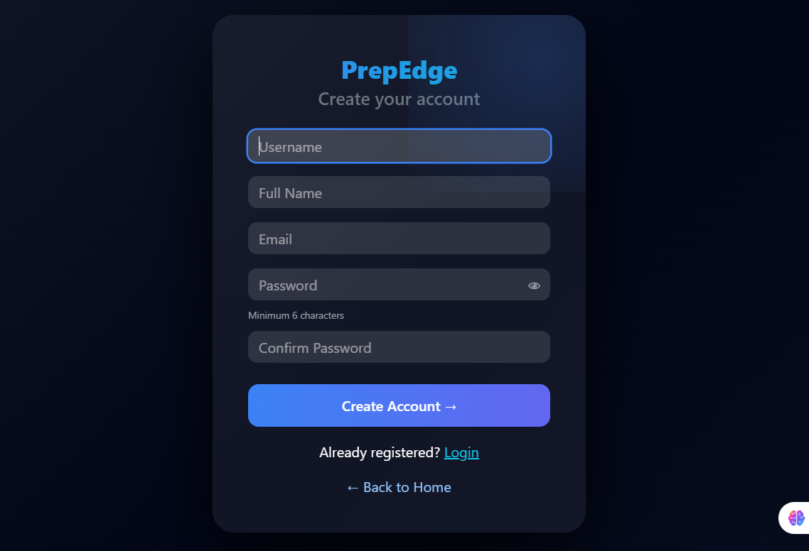 | 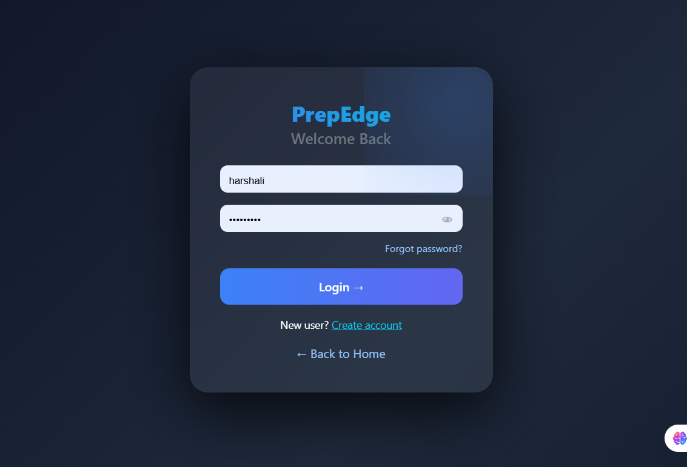 |

---

### Dashboard

| Home Page                 | Profile Page                 |
| ------------------------- | ---------------------------- |
| 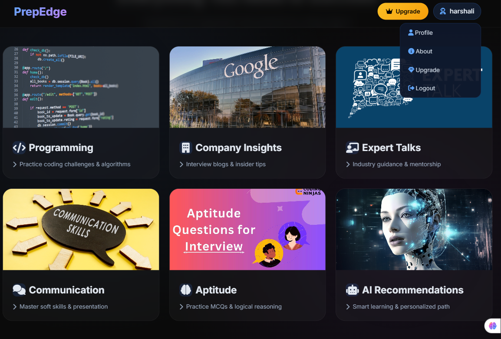 | 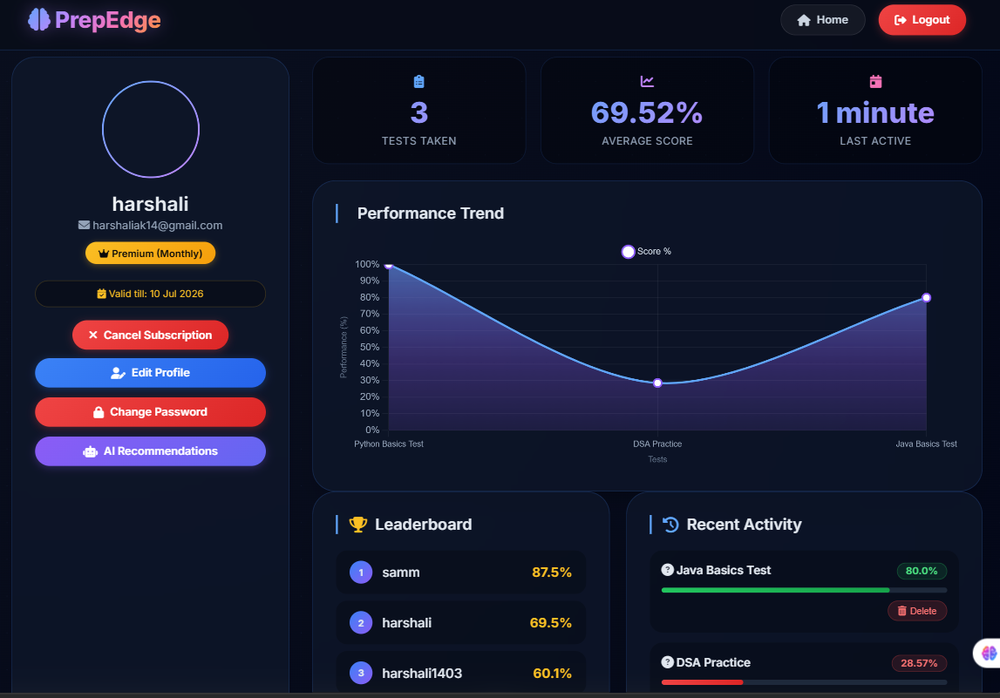 |

---

### Learning Platform

| Programming                      | Aptitude                      |
| -------------------------------- | ----------------------------- |
| 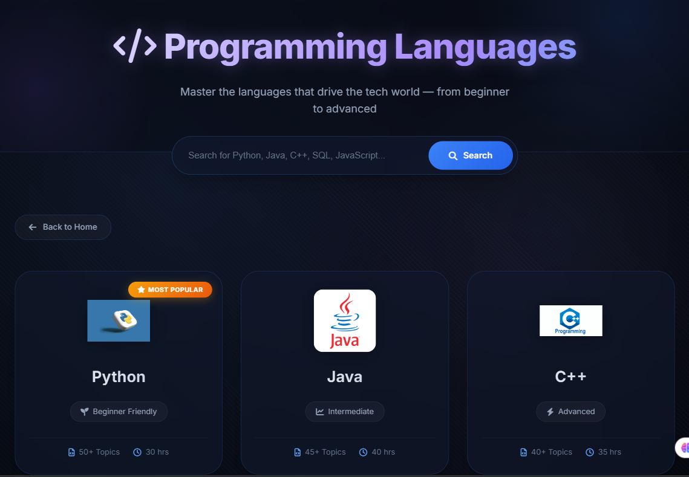 | 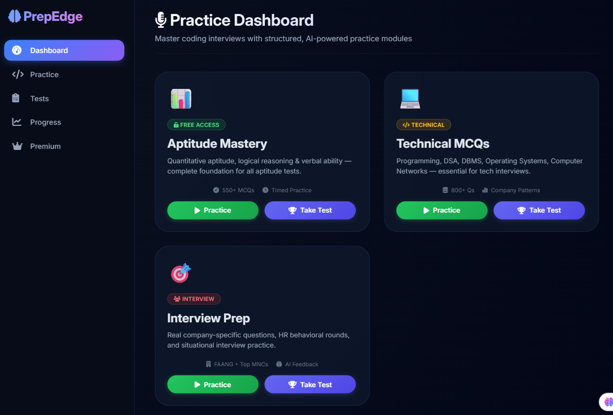 |

| Communication                      | Company                      |
| ---------------------------------- | ---------------------------- |
| 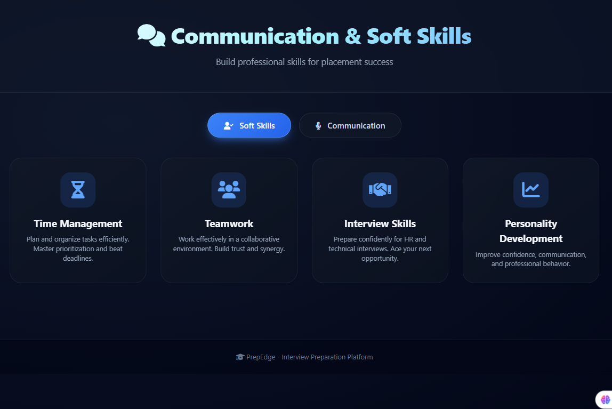 | 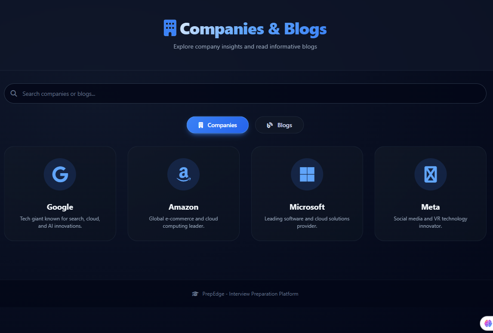 |

---

### Expert & AI Assistance

| Expert Talks                | AI Interview Coach      |
| --------------------------- | ----------------------- |
| 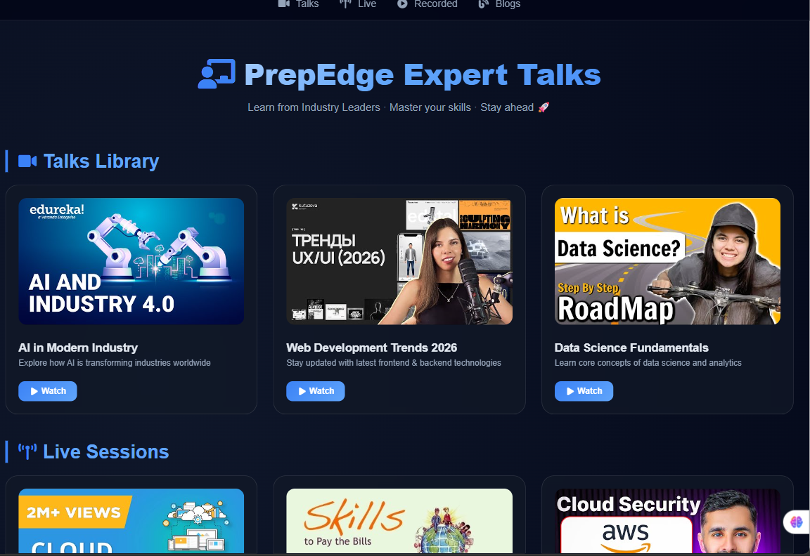 | 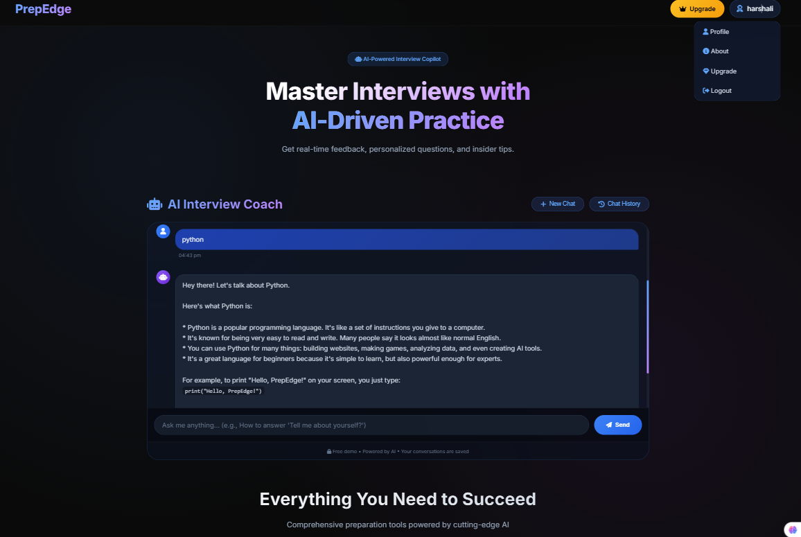 |

| Recommendations                     |
| ----------------------------------- |
| 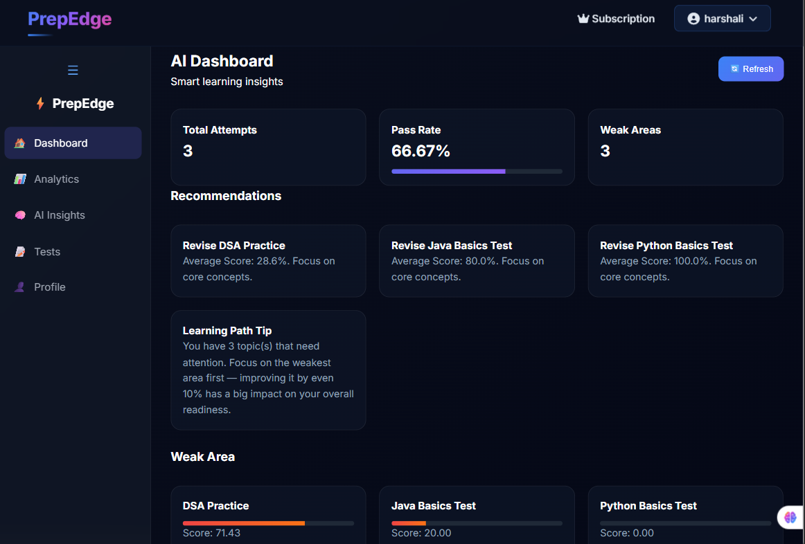 |

---

### Subscription System

| Subscription Plans                | Payment Integration          |
| --------------------------------- | ---------------------------- |
| 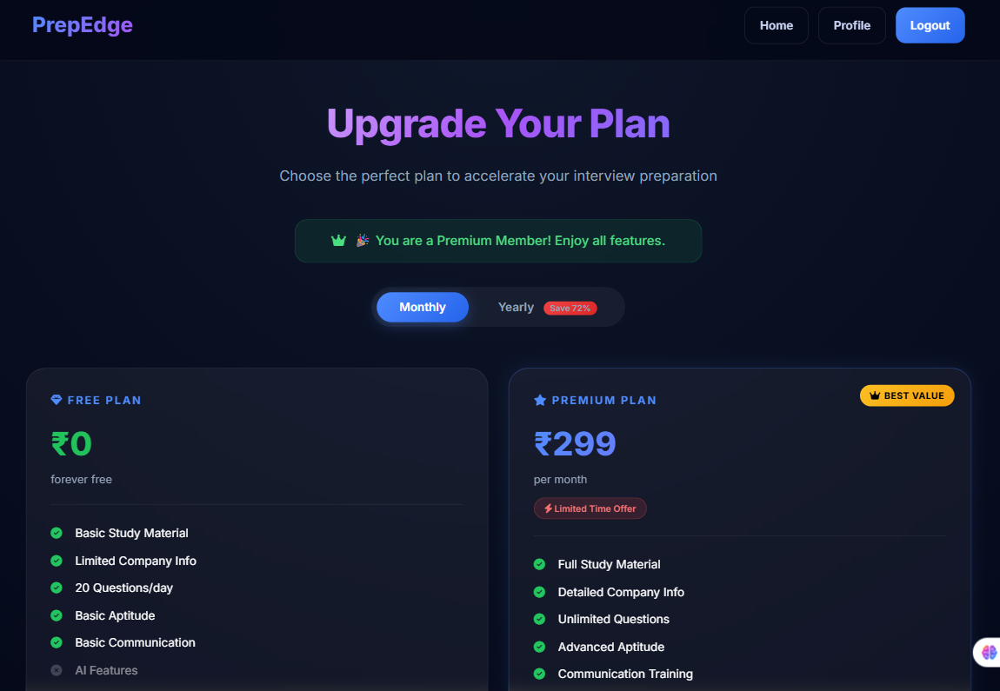 | 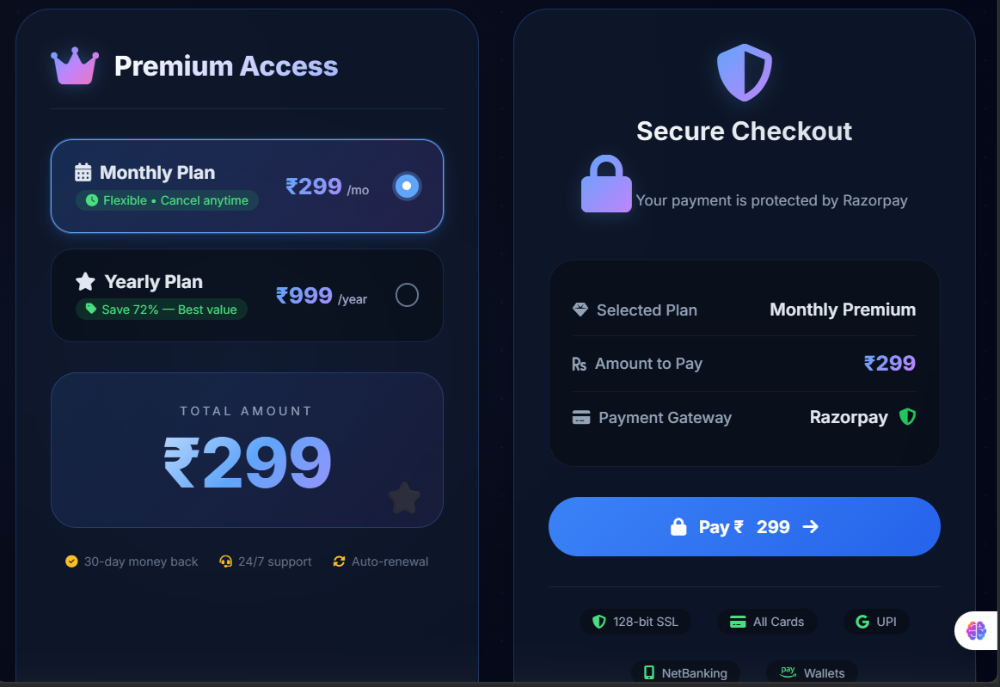 |

---

### About Platform

| About Page                 |
| -------------------------- |
| 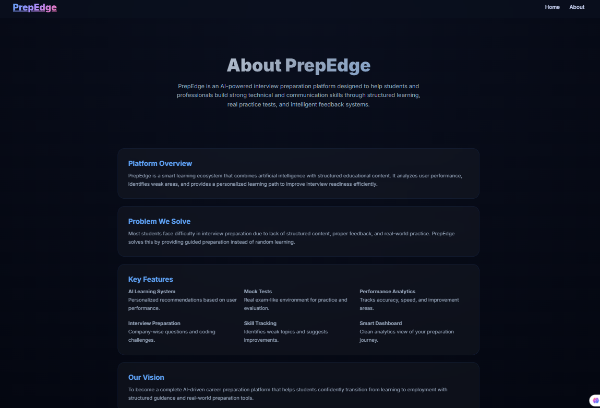 |

---

## Project Structure

```bash
prepedge-django-interview-platform
│
├── ai_coach/
├── ai_recommendations/
├── app1/
├── prepedge/
├── template/
├── screenshots/
├── static/
├── media/
├── manage.py
├── requirements.txt
└── README.md
```

---

## Getting Started

### Clone Repository

```bash
git clone https://github.com/Harshali-14/prepedge-django-interview-platform.git
cd prepedge-django-interview-platform
```

### Create Virtual Environment

```bash
python -m venv venv
```

### Activate Environment

```bash
venv\Scripts\activate
```

### Install Dependencies

```bash
pip install -r requirements.txt
```

### Apply Migrations

```bash
python manage.py migrate
```

### Run Server

```bash
python manage.py runserver
```

Open:

```text
http://127.0.0.1:8000/
```

---

## Future Enhancements

* Mobile Application
* Online Coding Compiler
* Live Mock Interviews
* Cloud Deployment
* Resume Analyzer
* AI-Powered Career Roadmap
* Company-Wise Preparation Tracks

---

## Developer

### Harshali Kulkarni

Python Developer • Django Developer • MCA Student

GitHub: https://github.com/Harshali-14

---

<div align="center">

If you found this project useful, consider giving it a star.

</div>
